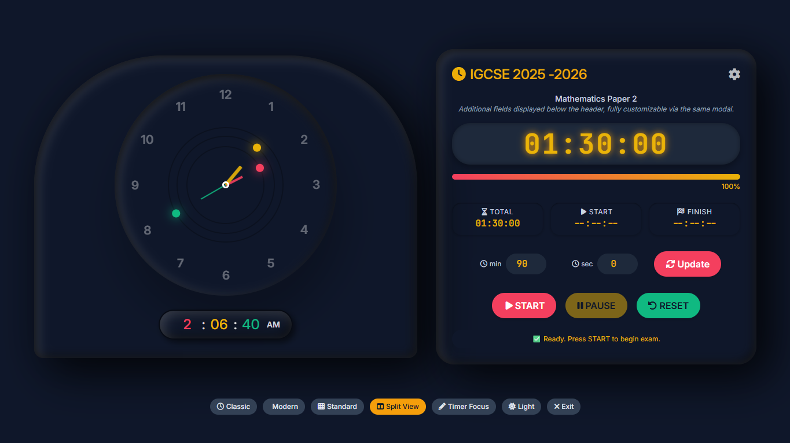
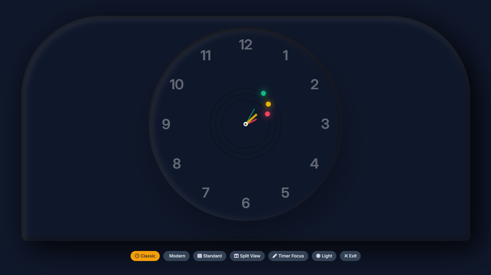
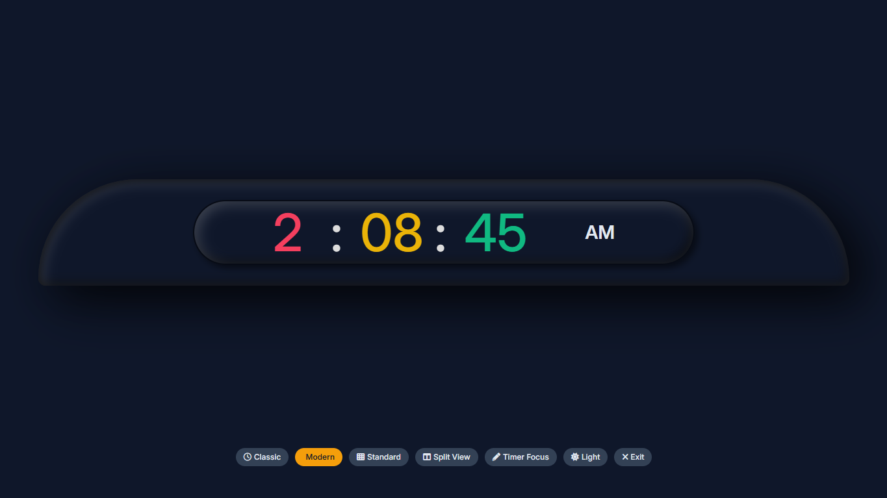
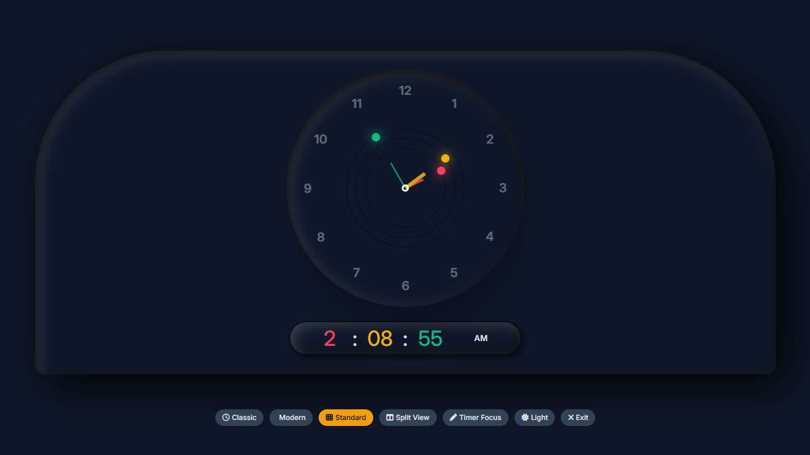
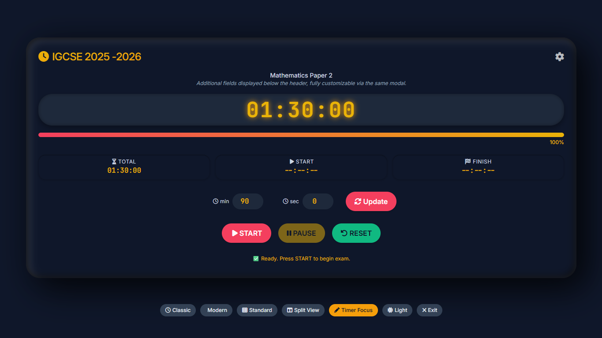
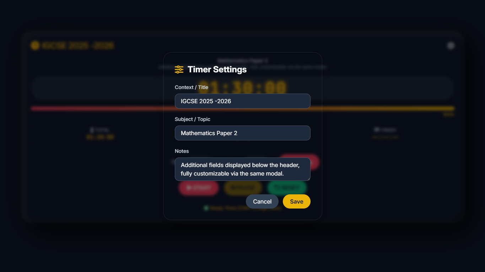

# Smart Clock & Timer – Dual View Clock + Timer

A clean, minimalist web app that combines an analog/digital clock with a countdown timer. Designed for timer settings, it features a distraction‑free interface with smooth animations and responsive layout.

 <!-- add a screenshot later -->

## Features

- **Real‑time analog clock** with hour, minute, and second hands.
- **Digital clock** displaying hours, minutes, seconds, and AM/PM.
- **Timer** with:
  - Custom duration (hours/minutes/seconds)
  - Start, pause, reset controls
  - Progress bar and percentage
  - Start time and estimated end time display
- **Three viewing modes**: Clock only, Timer only, or Both side‑by‑side.
- **Full‑screen toggle** – expand the interface for focused work.
- **Consistent color scheme** – the timer uses the same vibrant colors as the digital clock.
- **Responsive design** – works on desktop, tablet, and mobile.

## Technologies

- HTML5
- CSS3 (with CSS variables for easy theming)
- JavaScript (ES6 modules)
- Fullscreen API

## Usage

1. Set the timer duration using the minutes/seconds inputs and click **Set**.
2. Press **START** to begin the countdown.
3. Use **PAUSE** and **RESET** as needed.
4. Switch viewing modes using the buttons at the bottom.
5. Click **⛶ Fullscreen** to enter/exit full‑screen mode.

## File Structure

```

smart-clock/
├── index.html
├── assets/
│   ├── css/
│   │   └── styles.css
│   ├── js/
│   │   ├── main.js
│   │   ├── modules/
│   │   │   ├── clock.js
│   │   │   ├── fullscreen.js
│   │   │   ├── settings.js
│   │   │   ├── theme.js
│   │   │   ├── timer.js
│   │   │   └── view.js
│   │   └── utils/
│   │       └── helpers.js
│   └── images/
├── README.md

```

## Installation

Clone the repository and open `index.html` in any modern browser:

```bash
git clone https://github.com/silasdev-ke/smart-clock.git
cd smart-clock
open index.html   # or double‑click it
```

---

## 5. Optional: Addictional screenshot of the timer

### Classic View



### Modern Interface



### Standard Layout



### Active Timer



### Settings Layout



---
